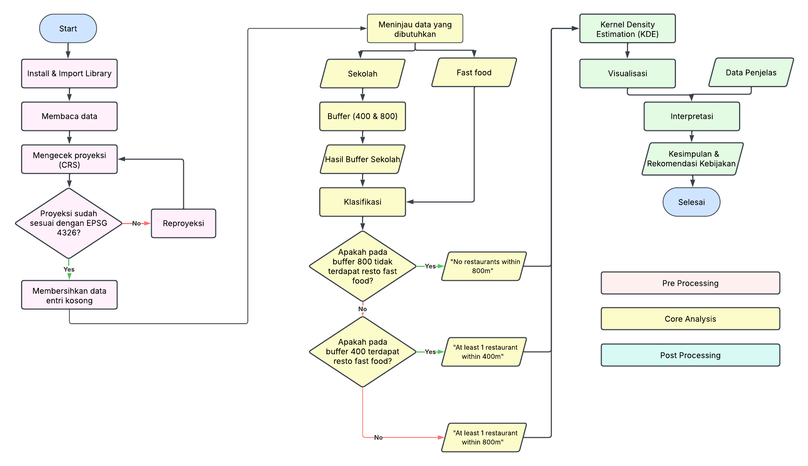

# **🍽️ Analisis Distribusi Restoran Cepat Saji dan Hubungannya dengan Kawasan Pendidikan**

## **Latar Belakang**

Obesitas sebagai suatu penyakit tidak lepas dari kondisi lingkungan yang mendorong terjadinya penyakit tersebut, atau yang sering disebut dengan lingkungan obesogenik. Lingkungan obesogenik mengacu pada pola penggunaan lahan yang tidak mendukung aktivitas fisik serta membatasi kesempatan untuk makan sehat, sehingga berkontribusi terhadap peningkatan obesitas (Black & Macinko, 2008; Cummins et al., 2005; Maddock, 2004; White, 2007). Salah satu faktor utama dalam lingkungan obesogenik adalah akses yang mudah ke makanan tidak sehat, seperti restoran makanan cepat saji (Simon et al., 2008).

Penelitian terbaru menunjukkan bahwa semakin dekat restoran makanan cepat saji dengan lingkungan sekolah, semakin tinggi risiko obesitas pada anak-anak. Currie et al. (2009) menemukan bahwa kehadiran restoran cepat saji dalam jarak 0.2 km dari sekolah dikaitkan dengan peningkatan 5.2% dalam tingkat obesitas di kalangan siswa kelas sembilan. Demikian pula, Davis dan Carpenter (2009) menemukan bahwa siswa yang memiliki restoran makanan cepat saji dalam radius 0.8 km dari sekolah mereka cenderung lebih jarang mengonsumsi buah dan sayuran segar, lebih banyak mengonsumsi soda, serta lebih mungkin mengalami kelebihan berat badan atau obesitas. Oleh karena itu, menjadi perhatian dalam kesehatan masyarakat bahwa restoran cepat saji cenderung berkelompok di sekitar sekolah, sehingga semakin memperburuk lingkungan obesogenik (Austin et al., 2005; Kipke et al., 2007; Simon et al., 2008; Sturm, 2008; Zenk & Powell, 2008).

Kecenderungan restoran makanan cepat saji untuk berlokasi di sekitar sekolah bukanlah kebetulan, melainkan bagian dari strategi bisnis industri makanan cepat saji. Industri ini secara aktif menargetkan anak-anak dan remaja sebagai bagian penting dari basis konsumennya, dengan memastikan kemudahan akses sebagai prioritas utama (Nestle, 2002; Schlosser, 2001). Para perencana bisnis telah lama menyadari bahwa pemilihan lokasi strategis dapat meningkatkan penjualan, sehingga mereka cenderung menempatkan restoran di lokasi yang dekat dengan target konsumennya (Melaniphy, 1992; Solomon & Katz, 1981; McKenna, 1972). Dalam menentukan lokasi, mereka mempertimbangkan berbagai faktor, seperti demografi lingkungan, keberadaan bisnis lain, organisasi komunitas, serta aspek jalan yang dapat menarik lebih banyak pelanggan potensial.

Maka dari itu, analisis spasial terhadap persebaran restoran cepat saji dan kawasan pendidikan menjadi penting untuk memahami sejauh mana lingkungan obesogenik terbentuk di sekitar sekolah. Dengan menggunakan teknologi Sistem Informasi Geografis (GIS) dan analisis spasial, kita dapat mengidentifikasi pola pengelompokan restoran cepat saji yang kedepannya bisa dijadikan dasar untuk mengukur tingkat keterpaparan siswa terhadap makanan tidak sehat, serta mengevaluasi dampaknya terhadap kesehatan anak-anak dan remaja. Kedepannya, hasil analisis ini berpotensi untuk dikembangkan menjadi rekomendasi kebijakan guna pencegahan atau penyelesaian masalah obesitas pada anak

## **Tujuan**

Menganalisis pola sebaran restoran cepat saji terhadap sekolah

## **Metode** mengacu pada Austin et al. (2005)
*   Mengukur tingkat pengelompokan (ketergantungan spasial) restoran cepat saji di sekitar sekolah pada jarak 0 hingga 1.5 km.
*   Metode ini mengidentifikasi jarak di mana pengelompokan terjadi dan menguji signifikansi statistiknya.
*   Buffer 400 meter dipilih berdasarkan estimasi bahwa orang dewasa dapat berjalan sejauh 400 meter dalam 5 menit.
*   Buffer 800 meter digunakan untuk menggambarkan lingkungan makanan sekolah yang lebih luas.
*   Menggunakan fungsi K bivariat untuk mengukur sejauh mana restoran cepat saji terkonsentrasi di sekitar sekolah pada jarak 0 hingga 1.5 km dari alamat sekolah.

## **Penjelasan Hasil**
Berdasarkan hasil pemetaan KDE, diperoleh bahwa sekolah dengan jangkauan fast food mudah terkonsentrasi pada wilayah Jakarta Pusat. Selain Jakarta Pusat, konsentrasi ini juga tersebar ke arah Jakarta Barat dan Jakarta Timur. Wilayah Jakarta Utara sebagian terdapat konsentrasi sekolah berjangkauan mudah tersebut akan tetapi hanya pada bagian yang bersinggungan dengan Jakarta Pusat. Jakarta Selatan di sisi lain hanya memiliki konsentrasi sedikit di daerah yang berada dekat dengan Jakarta Pusat--meski pada bagian selatannya terdapat banya sekolah dengan jangkauan mudah juga, tapi tidak terkonsentrasi tinggi. Kepulauan Seribu memiliki sekolah tapi tidak memiliki fast food, sehingga pemerintah tidak perlu khawatir akan potensi terbentuknya lingkungan obsogenik di sini.

Hasil analisis pemetaan KDE menunjukkan bahwa aksesibilitas sekolah terhadap restoran cepat saji di Jakarta bervariasi, dengan konsentrasi tertinggi berada di Jakarta Pusat, diikuti oleh Jakarta Barat dan Jakarta Timur. Jakarta Utara memiliki sebagian kecil sekolah dengan akses mudah ke restoran cepat saji, terutama di wilayah yang berbatasan dengan Jakarta Pusat. Sementara itu, Jakarta Selatan memiliki beberapa sekolah dengan akses mudah, tetapi tidak dalam konsentrasi tinggi. Kepulauan Seribu tidak memiliki restoran cepat saji, sehingga risiko terbentuknya lingkungan obesogenik di wilayah ini sangat rendah.

Secara keseluruhan, median jarak sekolah ke restoran cepat saji terdekat adalah 1.14 km atau sekitar 14 menit berjalan kaki. Sebanyak 19% sekolah memiliki setidaknya satu restoran cepat saji dalam radius 800 meter, dan 18% dalam radius 400 meter, yang menunjukkan potensi keterjangkauan tinggi terhadap makanan cepat saji. Kecamatan dengan jumlah sekolah terbanyak dalam kategori "memiliki setidaknya satu restoran cepat saji dalam radius 400 meter" adalah Cengkareng, Gambir, dan Grogol Petamburan.

## **Kesimpulan**
Jakarta masih memiliki ancaman potensi lingkungan obesogenik, ditandai dengan masih adanya konsentrasi sekolah yang mudah menjangkau fast food di lingkungannya. Secara keseluruhan, sekolah jakarta hanya berjarak 14 menit berjalan kaki dari fast food--yang artinya masih bisa terjangkau. Selain itu, terdapat 18% sekolah yang masih memiliki setidaknya 1 restoran dalam 400 meter. Berdasarkan jumlahnya, kecamatan dengan jumlah sekolah rentan lingkungan obesogenik yang paling banyak adalah Kecamatan Cengkareng, Kecamatan Gambir, dan Kecamatan Grogol Petamburan. Meski begitu, konsentrasi paling tinggi terletak pada wilayah Jakarta Pusat.

## **Rekomendasi**
- Melakukan pengaturan zonasi antara restoran fast food dan sekolah

Sebisa mungkin, pemerintah melakukan intervensi untuk meregulasi keterjangkauan anak terhadap restoran fast food untuk menghindari terciptanya lingkungan obesogenik. Misalnya, membatasi ketentuan jenis restoran yang boleh membuka gerai pada radius < km

- Memberikan alternatif makanan pada sekolah yang memiliki keterjangkauan tinggi terhadap fast food

Apabila zonasi tidak memungkinkan, pemerintah dapat memberikan perhatian lebih kepada sekolah dan wilayah yang memiliki akses mudah terhadap fast food dengan memberikan opsi makanan sehat yang memiliki akses jauh lebih mudah sehingga anak akan lebih memilih untuk membeli makanan sehat

